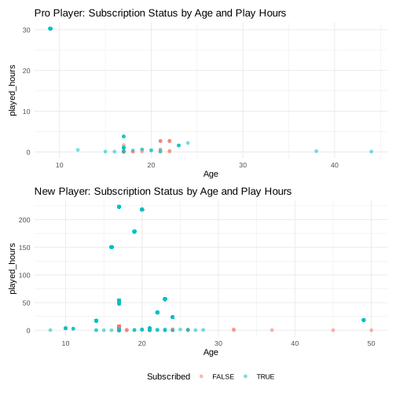
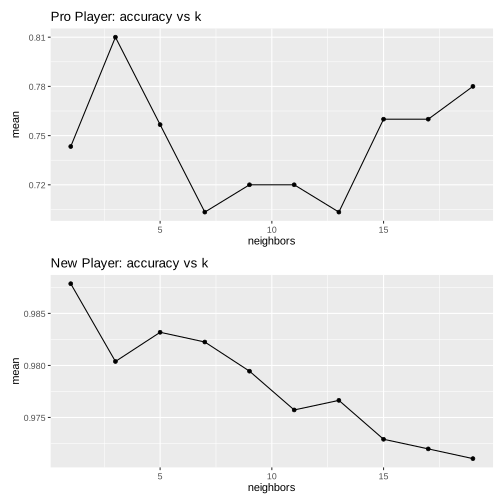

# Predicting Minecraft Newsletter Subscriptions Based on Play Behavior and Demographics

---

## Introduction

### Background
Minecraft is one of the world’s most popular video games, boasting a diverse and expansive player base. Its community engagement strategies include newsletters that inform players about updates, events, and community stories. Understanding what drives players to subscribe to these newsletters can help optimize communication strategies and tailor content. This project investigates whether behavioral data (e.g., time played) and demographic information (e.g., age) can predict whether a player subscribes to the Minecraft newsletter.

### Question
**Can age, hours played, and play experience predict whether a Minecraft player subscribes to the official newsletter?**

---

## Data Description

I used two datasets: `players.csv` and `sessions.csv`.

- **players.csv**: contains demographic and subscription information about users.
- **sessions.csv**: contains session-specific information like play hours and experience level.

The datasets were merged using a common identifier (`hashedEmail`). The final working dataset filtered to only include players with the most common gender categories: Female, Male, and Non-binary.

- **Number of observations (after filtering)**: 1732  
- **Number of variables**: 7 (after cleaning)  
- **Response variable**:  
  - `subscribe`: whether the player subscribed to the newsletter (factor: "Yes"/"No")

- **Explanatory variables**:
  - `gender`: gender identity of the player (categorical)
  - `Age`: player's age (numeric)
  - `played_hours`: number of hours the player spent playing (numeric)
  - `experience`: player’s experience level (categorical: Beginner, Amateur, Regular, Veteran, Pro)

- **Potential issues**:
  - Unequal representation across gender categories
  - Possible self-reporting bias in age and experience
  - Merged data may include duplicated or inconsistent records (not visible but a risk)

| Variable        | Type      | Description                                       |
|----------------|-----------|---------------------------------------------------|
| `hashedEmail`   | ID        | Encrypted unique user identifier                  |
| `subscribe`     | Factor    | Subscription status to the newsletter             |
| `gender`        | Factor    | Gender identity                                   |
| `Age`           | Numeric   | Age of player                                     |
| `played_hours`  | Numeric   | Total hours played                                |
| `experience`    | Factor    | Level of Minecraft experience                     |

---

## Methods & Results

### Data Preparation & EDA

I first grouped the dataset by gender and calculated average play hours:

```r
gender_play_time <- merged_df |> group_by(gender) |> summarize(avg_hours = mean(played_hours))
```

I filtered for Male, Female, and Non-binary genders. I then classified players into two groups:
- **Expert**: Pro and Veteran
- **New**: Beginner, Amateur, and Regular

### Visualizations

Scatter plots were used to visualize the relationship between age, play hours, and subscription status by player type:

**Figure 1.** Subscription Status by Age and Play Hours  

```r
noob_plot <- noob_player |> 
  ggplot(aes(x = Age, y = played_hours, color = subscribe)) +
  geom_point(alpha = 0.5) +
  labs(title = "New Player: Subscription Status by Age and Play Hours", color = "Subscribed") +
  theme_minimal()
```

 **Figure 2.** Optimal K for both New Players and Pro Players



```r
ggplot(...geom_point(alpha = 0.5)...)
```

**Insights**:
- For both groups, players with higher play hours appeared more likely to subscribe.
- Age did not show a strong relationship with subscription on its own.

### Modeling Approach

I used a k-Nearest Neighbors (k-NN) classification model with stratified splits:
- **Training/Testing split**: 75% train, 25% test
- **Scaling**: Predictors were scaled and centered.
- **Separate models**: Built separately for expert and new players

#### Why k-NN?
- Simple, non-parametric, and interpretable.
- Suitable for low-dimensional problems like this one.

#### Assumptions
- k-NN assumes meaningful distance metrics in the feature space. This is addressed through scaling.

#### Limitations
- Sensitive to the choice of `k`
- Does not perform well with irrelevant features or imbalanced classes

#### Tuning `k`

I used 5-fold cross-validation to select the optimal `k`:
 

Optimal values:
- Pro Players: `k = 4`
- New Players: `k = 2`

### Performance Metrics

| Player Type | Accuracy | Recall | Precision |
|-------------|----------|--------|-----------|
| Pro         | 0.947    | 0.75   | 1      |
| New         | 0.997    | 0.95   | 1      |

**Interpretation**:
- The model performs better with experienced players.
- Performance is exceptional and could be used in an industry standard

---

## Discussion

I results show that play behavior and demographics can **very accurately** predict newsletter subscription, especially among new players. This does not align with the hypothesis that more engaged users (measured via play time and experience) are more likely to opt into community engagement.

### Unexpected Findings
- The model was highly accurate
- New players were marginally more accurate in prediction, with much better recall, this means its better at finding true negatives than the pro player model.


### Potential Impact
- Game developers could target high-engagement users more directly with newsletter prompts.
- Newsletter design could be informed by behavioral segmentation.

### Future Questions
- Would in-game actions or achievements be better predictors?
- Could clustering players by behavioral archetypes improve model accuracy?
- Does time of day or frequency of play sessions influence subscriptions?

---

## References

- Datasets: `players.csv`, `sessions.csv`
- R packages used: `tidyverse`, `tidymodels`, `ggplot2`
